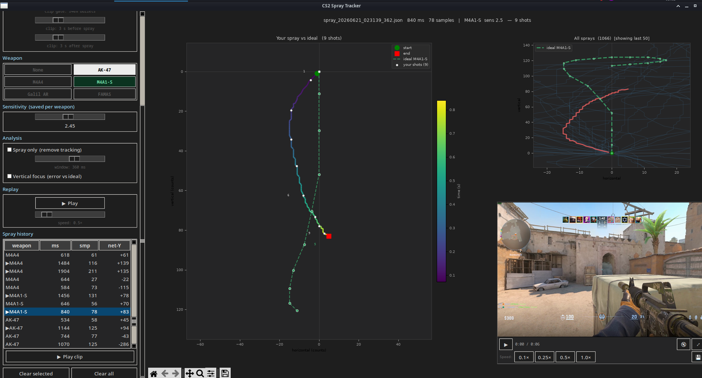

# CS2 Spray Tracker

Record your own mouse movement during a spray (click-and-hold), compare it against the weapon's ideal recoil pattern, and optionally review it as a trimmed video clip — all inside one live GUI.

---

## This is not a cheat

**This tool does not interact with CS2 or any game in any way.**

- It does not read game memory, network traffic, or any game state.
- It does not inject input, synthesize mouse events, or control the mouse.
- It does not modify game files, configs, or the game process.
- It gives you zero in-game advantage. It cannot aim for you, reduce recoil for you, or do anything during a match.
- It is not detectable by anti-cheat (VAC, FACEIT, etc.) because it does not touch the game at all.

What it does is read the same raw motion events from your physical mouse that your OS reads anyway — the same numbers your hand is already producing. After you finish a spray and release the mouse button, it draws a graph of the path your hand took. That's the entire interaction with anything game-related.

It is a **practice journal for your hand**, not a tool for your game client. The equivalent of filming yourself at a shooting range and watching the footage back — something you do off the range, with no effect on the next shot.

---



---

## Install

### Dependencies (Manjaro / Arch)

```bash
sudo pacman -S python-evdev python-matplotlib python-numpy tk python-pillow
```

`ffmpeg` and `ffprobe` are also needed for the clip player (usually already installed):

```bash
sudo pacman -S ffmpeg
```

### Python environment

The system Python on Manjaro is 3.14, which may not have compatible numpy wheels. Use a 3.12 venv:

```bash
python3.12 -m venv .venv
.venv/bin/pip install evdev matplotlib numpy pillow
```

Then run with `.venv/bin/python3 spray_gui.py`.

### Device access

Reading the mouse needs no `sudo` because your user must be in the `input` group. Verify:

```bash
groups   # you should see "input"
```

If not:

```bash
sudo usermod -aG input $USER   # then log out and back in
```

---

## Running the GUI

```bash
.venv/bin/python3 spray_gui.py
```

Optional flags:

| Flag | Meaning |
|------|---------|
| `--device /dev/input/event3` | skip auto-detect, use a specific device |
| `--out ~/cs2-sprays` | where to save sprays (default: `./sprays`) |

---

## Layout

```
┌─────────────────┬──────────────────────────────────────┐
│                 │  All sprays (overlaid + spread)       │
│  Sidebar        ├──────────────────────────────┬───────-┤
│  (controls)     │                              │  Video │
│                 │  Trajectory of selected      │  clip  │
│                 │  spray + ideal pattern       │ player │
└─────────────────┴──────────────────────────────┴────────┘
```

- **Left sidebar** — all controls (see below)
- **Top right** — all recent sprays overlaid; colored dots are your shots, weapon-colored dots are the ideal pattern; consistency spread shown in the legend
- **Bottom left (main)** — single spray trajectory, ideal pattern overlay, colored by time (green = first bullet)
- **Bottom right** — embedded video clip player (see Clip Player below)

---

## Sidebar controls

### Weapon

Toggle buttons: `None`, `AK-47`, `M4A4`, `M4A1-S`, `Galil AR`, `FAMAS`. Switching weapon changes the ideal pattern overlay on the plots **and** remembers a per-weapon sensitivity.

### Sensitivity

Drag the slider to scale the recorded movement for comparison against the ideal pattern. Each weapon remembers its own sensitivity value.

### Detrend (analysis)

Removes slow tracking drift using a Gaussian smoothing window. Useful when your hand drifts slightly even during a spray. Toggle on/off; drag the window slider (30–600 ms).

### Vertical focus

Shows only the vertical (Y) axis deviation from ideal instead of the 2D trajectory. Useful for isolating pull-down consistency.

### Recorder

1. Pick the mouse device from the dropdown (auto-listed; hot-reload via **Refresh**).
2. Click **Arm recorder** — it stays armed until you click again.
3. **Hold LMB** to record a spray; **release** to save it.

A new entry appears in the history list automatically.

**Min hold** slider (100–2000 ms): sprays shorter than this are ignored — protects against accidental single clicks.

**Live view**: plots update in real time while you're holding LMB, frame by frame.

**Auto-clip**: integrates with GPU Screen Recorder (gsr) — saves a trimmed clip of each qualifying spray automatically. See [Clip setup](#clip-setup-gpu-screen-recorder) below.

**Clip gate slider** (0–100 %): only save a clip if you fired at least this percentage of the magazine. Default 40 %. Set to 0 % to clip every spray; set to 100 % to only clip full sprays.

**Clip before / after sliders** (0–10 s): how many seconds of footage to include before the first bullet and after the last bullet. Both default to 3 s. The "after" value also sets the delay before the GSR save is triggered, ensuring the buffer actually contains that much post-spray footage.

**Chain gap slider** (0–5 s, default 1 s): if two consecutive sprays are separated by less than this gap, they are linked into a **spray chain**. The history shows the chain as one row (⛓N prefix for N sprays), the trajectory concatenates all sprays end-to-end, and the clip gate checks combined bullet count across the whole chain — one clip is saved for the full chain. Set to 0 s to disable chaining.

### Spray history

Table of recorded sprays (one row per chain if chaining is enabled, or one per spray if the gap slider is 0). Click any row to load it into the plots and the clip player. Columns: weapon, duration (ms), sample count, net-Y (total vertical pull in mouse counts). A ⛓N prefix indicates a chain of N sprays; a ▶ prefix means a clip is saved.

**Play clip** button (below the table) appears when the selected spray has a saved clip.

---

## Clip player

The bottom-right panel is an embedded video player. It loads the first frame automatically when you select a spray with a clip.

### Controls

| Button | Action |
|--------|--------|
| ▶ / ⏸ | Play / pause |
| 🔇 / 🔊 | Mute / unmute audio (default: muted) |
| ⤢ / ⤡ | Expand to full canvas / restore corner |
| 💾 | Export the trimmed clip as a standalone `.mp4` |
| `0.1×` `0.25×` `0.5×` `1.0×` | Playback speed |

The time display (`0:05 / 0:09`) shows position and duration of the **trimmed** window, not the raw clip. Video and audio are wall-clock synced — frames are dropped or held to match elapsed real time, so playback never drifts.

### Trim logic

GSR saves the last N seconds of replay when triggered. Because most of that is idle time before the spray, the player automatically trims the clip to:

```
[ before buffer ] → [ spray ] → [ after buffer ]
```

Both buffers default to **3 seconds** and are adjustable via sliders in the sidebar (0–10 s, 0.5 s steps). The before/after values are persisted in `settings.json`. The after buffer also controls how long the tracker waits before triggering the GSR save, so the clip always contains the full post-spray window you configured.

---

## Clip setup (GPU Screen Recorder)

The auto-clip feature sends `SIGRTMIN+1` to a running `gpu-screen-recorder` process at the moment a spray ends, causing gsr to save its replay buffer as an `.mp4`. No screen capture toggle, no manual steps.

### Requirements

- [GPU Screen Recorder](https://git.dec05eba.com/gpu-screen-recorder) (`gpu-screen-recorder` AUR package)
- gsr running in **continuous replay mode** before you start playing

### Start gsr in replay mode

```bash
gpu-screen-recorder \
  -w screen \
  -f 60 \
  -q ultra \
  -a default_output \
  -r 300 \
  -replay-storage ram \
  -o /path/to/your/replays
```

Key flags:

| Flag | Meaning |
|------|---------|
| `-r 300` | keep a rolling 300-second replay buffer |
| `-replay-storage ram` | store buffer in RAM (faster, no disk wear) |
| `-o /path/` | where saved clips land (directory, not a filename) |
| `-w screen` | capture entire screen (or use `-w DP-0` for a specific output) |

The tracker finds the gsr process automatically by reading `/proc/<pid>/cmdline` for the `-o` flag — no config file needed. The gsr HUD notification is suppressed so it does not appear on screen.

### Workflow

1. Launch gsr in replay mode (one terminal, leave it running).
2. Launch the spray tracker GUI.
3. Enable **Auto-clip** and arm the recorder in the sidebar.
4. Play CS2; spray normally.
5. After each qualifying spray, the tracker saves a trimmed clip automatically and loads it into the bottom-right panel within a few seconds.

---

## Files

| File | Purpose |
|------|---------|
| `spray_gui.py` | Main GUI — recorder, live viewer, clip player in one window |
| `spray_record.py` | Standalone CLI recorder (no GUI, writes JSON sprays) |
| `spray_view.py` | Standalone CLI viewer (plots from saved JSONs) |
| `settings.json` | Persisted settings (auto-written; gitignored) |
| `sprays/` | Recorded sprays + clips (created on first run; gitignored) |

---

## Technical notes

### Why raw evdev

CS2 (and most games using raw input) grab the cursor so it never moves on screen. The OS cursor position is useless. `evdev` reads the kernel's raw relative motion events before they reach any window manager, which is exactly the input the game receives.

### Why PIL + ffmpeg for the clip player

Embedding a media player window via XID (`mpv --wid=`) fails silently on systems running a compositor or XWayland. Instead, the player pipes frames from `ffmpeg` as raw RGB24 bytes, converts them to `PhotoImage` in tkinter's main thread, and schedules display ticks with `root.after()`. This works everywhere, with no native window embedding.

### GUI hover guard

The recorder ignores LMB presses that happen while the mouse cursor is inside the GUI window. This prevents dragging a slider or clicking a button from being logged as a spray. The check runs every 50 ms via a `root.after` loop comparing the pointer position to the window geometry.

### Thread safety

- The evdev recorder runs in a daemon thread; finished sprays are posted to a `queue.Queue`.
- The GUI polls the queue every 500 ms and updates the plots on the main thread.
- The clip decoder runs ffmpeg as a subprocess piping into a `Queue(maxsize=300)`; the main thread's `root.after` tick drains one frame per interval. `ImageTk.PhotoImage` is always created on the main thread.
